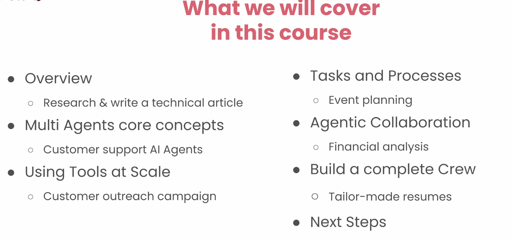
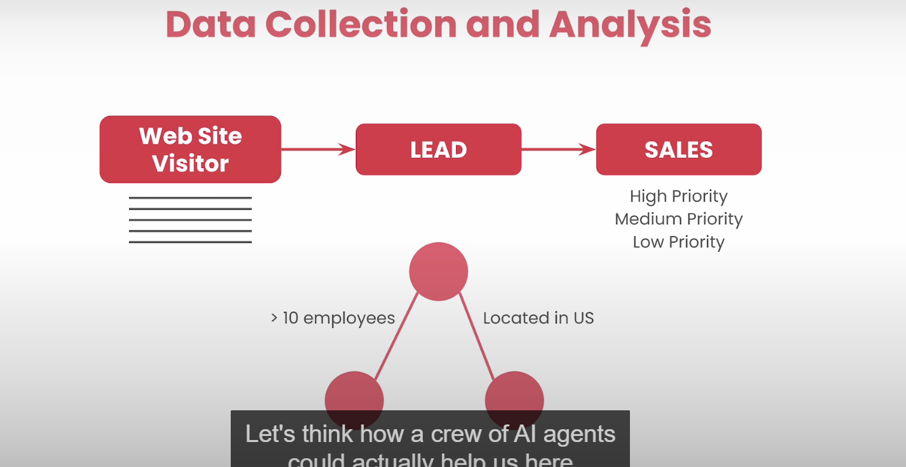

serperdevtool search google

scraper access website content
websitesearch tools doies rag: semantic search ofn the content pf a webnsite

an agent with 30 tools will only use the tools it assigned to it  even if its three leaving the rest 30 except you leave it at default when it does only one thing

## mental model of agents

who should i pick for the job

